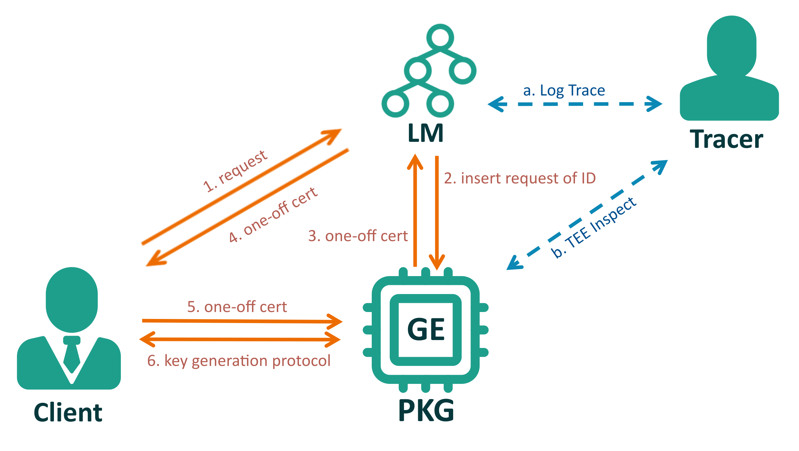

<head>
    
    
</head>

## What is **Portex**?

**Portex** is a novel accountable decryption system. We extend such a research direction: *using a trusted hardware-based log to make decryption accountable*, but we consider the risk of the compromised trusted hardware and introduce a tracing mechanism. In our scheme, the decryption key is sealed in the trusted hardware (e.g., Trusted Execution Environment), and each decryption will trigger an automatic update of the transparent log. Then, a tracer can check the log to show evidence of users' misbehaviours of decryption. Meanwhile, the tracing mechanism ensures TEE's action of the key generation or key distribution accountable. 

## Contributions

- We propose a practical accountable cryptosystems, in which the users are accountable for their decryption. Each decryption will be faithfully recorded by the log maintainer, whose actions are publicly verifiable. 

- Our proposed scheme relies on TEE, but we further take consider the mainstream vulnerability of TEE that may leak the users' private keys and destroy accountability. We accordingly design a tracing mechanism to make trusted hardware, additionally, accountable for the private key generation and distribution.
- We formalize the syntax and security definitions of **Portex**. The formal security analyses indicate that our system is provably secure, which satisfies the properties of *key privacy*, *fairness*, *completeness*, and *TEE traceability*.

- We provide a full-functional implementation for **Portex** and evaluate performance in terms of *theoretical complexity*, *running time*, and *log size* for major functionalities. The experimental results demonstrate the feasibility and efficiency of our system. 

## Designs

In **Portex**, four types of entities are involved: *private key generator* PKG, a *log manager* LM, and user clients CLIENTS and tracers TRACERS. The PKG is required to run inside TEEs. The log manager and users' platforms do not necessarily to support TEEs. Similar to the standard IBE system, the PKG is responsible for generating the public parameters and extracting and distributing the user's private key. User clients CLIENTS are used to perform the decryption of ciphertext. The LM updates and stores the logs when PKG distributes a private key. TRACERS that any roles can serve are responsible for detecting the wrongdoing of CLIENTS and the TEE-based PKG and users. The main idea behind **Portex** is to run PKG inside a TEE and force the action of key generation to render a public auditable log.

## Workflow

0. Loads the PKG into the generation enclave (GE) for generating the public parameters and the master private keys. 

1. When a user attempts to get a private key, the client sends a key request to the log manager. 
2. If the user's identity is valid, the log manager updates the log tree, generates and sends a set of proofs to PKG. 
3. The PKG verifies the proofs and updates its root hash. Then PKG generates a *one-off certificate* $oc$ and sends it back to LM. 
4. LM transfers such a *certificate* to the user's client. 
5. The ciphertext is encrypted using the user's identity. If a user wants to decrypt the ciphertext, he has to send the $oc$ to the PKG. 
6. When PKG receives the request from the user, it will run the private key generation protocol.

